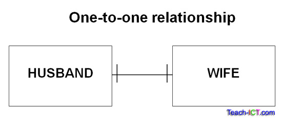
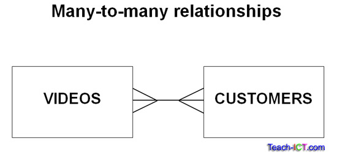

# SQL Interview Questions

## DBMS Interview Questions

https://www.interviewbit.com/dbms-interview-questions/

### What is a lock. Shared lock vs. exclusive lock.

- A database lock is a mechanism to protect a shared piece of data from getting updated by two or more database users
at the same time. When a single database user or session has acquired a lock then no other database user or session
can modify that data until the lock is released.

### Explain the difference between the DELETE and TRUNCATE command in a DBMS.

https://stackoverflow.com/questions/139630/whats-the-difference-between-truncate-and-delete-in-sql

## Different types of joins

- https://www.w3schools.com/sql/sql_join.asp

## Different Types of relationships

https://www.interviewbit.com/dbms-interview-questions/

### One-to-one relationships

- [Source](https://www.teach-ict.com/as_a2_ict_new/ocr/AS_G061/315_database_concepts/attributes_entities/miniweb/pg6.htm)
- Husband -- Wife
- A husband can only have one wife.
- A wife can only have one husband.

### One-to-many (or many-to-one) relationships

 relationships")

- [Source](https://www.teach-ict.com/as_a2_ict_new/ocr/AS_G061/315_database_concepts/attributes_entities/miniweb/pg7.htm)
- Mother --< Children
- A mother can have many children.
- A child can have only one mother.

### Many-to-many relationships

- [Source](https://www.teach-ict.com/as_a2_ict_new/ocr/AS_G061/315_database_concepts/attributes_entities/miniweb/pg8.htm)
- Videos >--< Customers
- A video can be hired by many customers.
- Customers can hire many videos.
